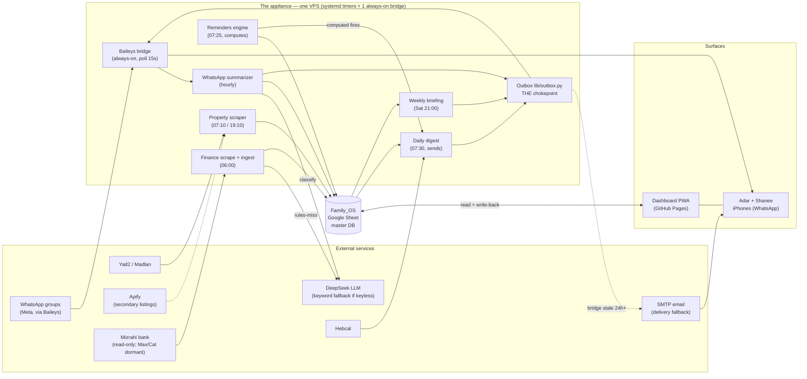
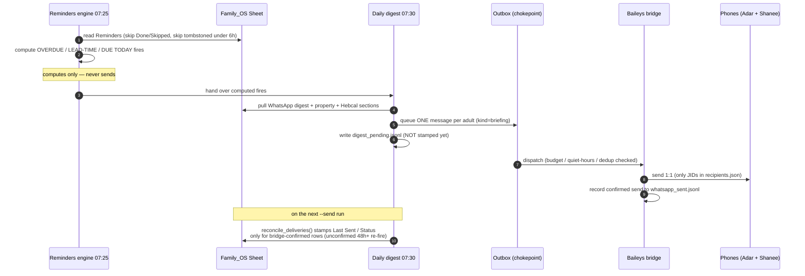
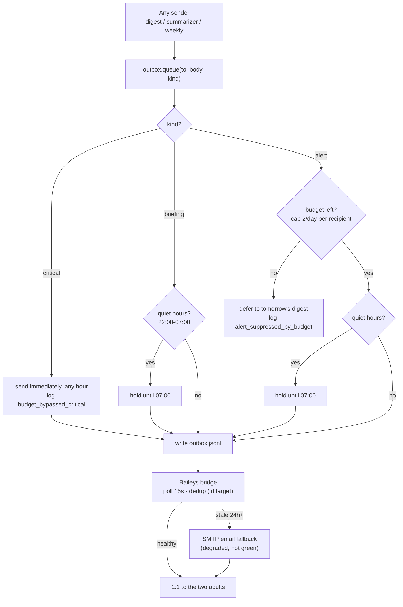
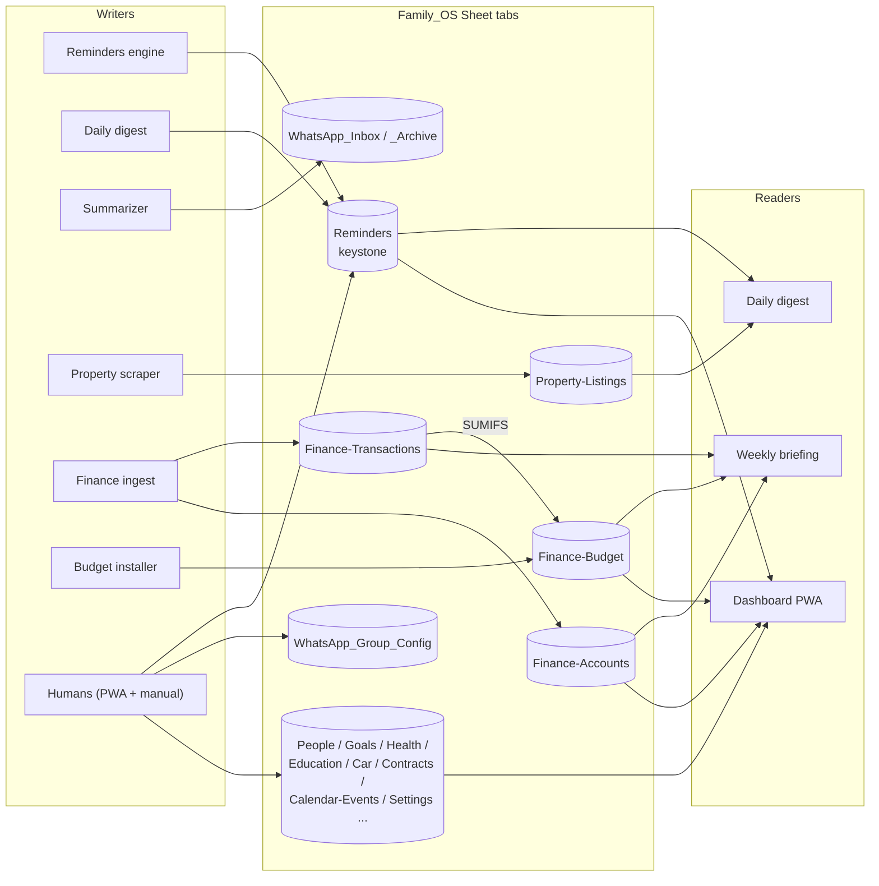
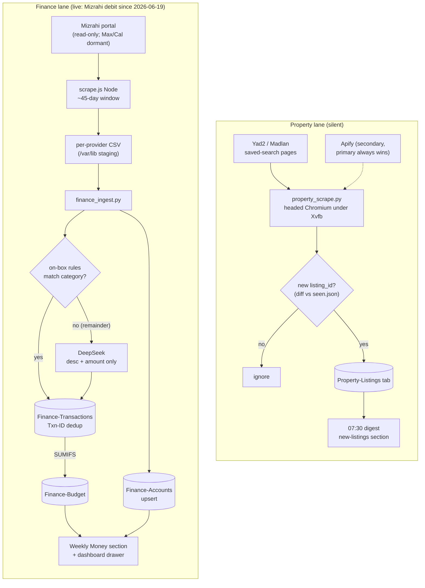
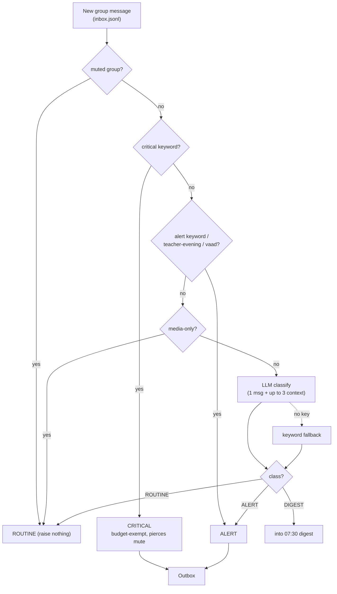
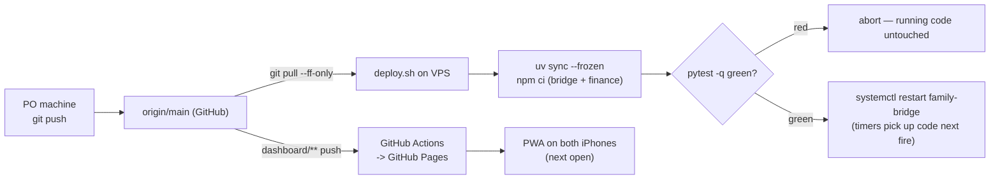
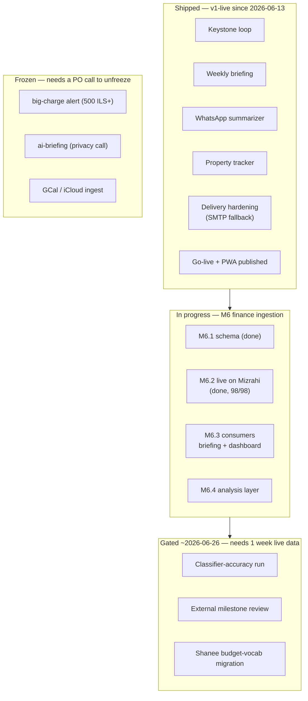
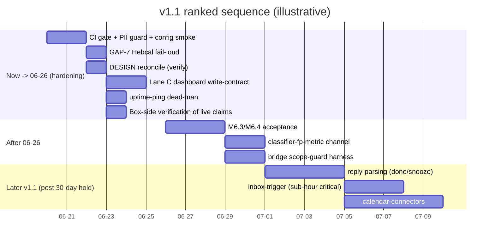

# Family Inc. — Visual Overview

> **Non-canon visual aid**, generated 2026-06-20 from the five canon docs (`SPEC.md`, `ENGINEERING.md`, `DESIGN.md`, `BACKLOG.md`, `ROADMAP.md`) + the `deploy/systemd/` units. Safe to delete or regenerate; the canon docs remain the source of truth. Open in any Mermaid-rendering viewer (GitHub, VS Code, Obsidian, the dashboard) to see the diagrams.

A household operating system for **Adar + Shanee** (+ 2 young kids, adult-mediated). It watches obligations — appointments, renewals, deadlines, school/daycare chatter, finances, property listings — and reflects them back through **two calm surfaces** (a few WhatsApp messages + a PWA dashboard) over **one master Google Sheet**. All automation runs unattended on **one VPS** ("the appliance"). Israeli context throughout: Hebrew/RTL, ILS, Asia/Jerusalem, Hebcal.

## The three architectural invariants

| Invariant | What it means |
|---|---|
| **One machine** | The bridge + every timer share one VPS, so a failure is total and obvious (never partial/silent). |
| **One data plane** | Python writes the Sheet via a gspread **service account**; the dashboard reads/writes via per-adult **gapi OAuth**. `Family_OS.xlsx` is a seed template only. |
| **One write path to phones** | Everything that reaches a human goes through `lib/outbox.py` — budget, dedup, quiet-hours, and scope live there exactly once. |

---

## 1. System landscape — what talks to what



---

## 2. The keystone loop — reminders → digest → write-back

The heart of the system. Note: **queueing is not delivery** — rows are stamped back onto the Sheet only after the bridge *confirms* the send, on the *next* run.



---

## 3. The daily clock — 7 systemd timers (Asia/Jerusalem)

Morning order is deliberate: finance lands first so balances are fresh, then reminders compute *before* the digest assembles. `family-digest.service` has `After=family-reminders.service`. All timers are `Persistent=true` (catch up missed runs after downtime).

```mermaid
gantt
  title Daily clock — Asia/Jerusalem
  dateFormat HH:mm
  axisFormat %H:%M
  section Always-on
  Baileys bridge (listen + send)        :active, 00:00, 24h
  WhatsApp summarizer (hourly, x24)     :        00:00, 24h
  section Morning chain
  Finance scrape + ingest               :crit, 06:00, 40m
  Property scrape (AM)                  :      07:10, 15m
  Reminders engine (compute, no send)   :      07:25, 8m
  Daily digest -> WhatsApp + write-back :crit, 07:30, 12m
  section Evening
  Property scrape (PM)                  :      19:10, 15m
```



**Off this 24h axis:** Weekly briefing **Sat 21:00**, backup to Drive **Sun 03:00**, and **quiet hours 22:00–07:00** (ordinary alerts + briefings held; criticals pierce).

---

## 4. The outbox chokepoint + delivery fallback

Every sender funnels here. Three message *kinds* get different treatment; the 2/day budget ledger is **shared across all senders** so two scripts can't each spend their own quota.



> Documented deeper fallbacks (not in code): **Twilio WhatsApp** → **Inforu SMS**, revisited only after 2+ failures of the layers above.

---

## 5. Data model — who writes each tab, who reads it

One source of truth per domain. `lib/sheet.py` is the **only** Python writer; the dashboard writes back via OAuth. Schema changes are **additive-only**.



**Keys:** Reminders write-back stamps cols `M LastDoneBy · N DoneAt · O WriteQueue_Tombstone`. Property dedups on `listing_id` (vs `seen.json`). Finance dedups on `Txn-ID` = stable hash of `Date|Amount|Description|Account` (the provider id was rejected — it collided and dropped ~70% of rows on first import).

---

## 6. The two ingestion lanes — property + finance

Both deliver **silently** and never spend the alert budget.



---

## 7. WhatsApp summarizer — classification pipeline

Hard rules run first (cheap, deterministic); only the remainder reaches the LLM; if there's no key, a keyword fallback keeps it working keyless.



---

## 8. Deploy topology — committed ≠ deployed

`deploy.sh` is the only way code reaches the box; red tests abort the deploy and leave running code untouched. Timers pick up new code on their next fire — only the long-running bridge is restarted.



---

## 9. Status & roadmap



**v1.1 ranked sequence** (bars are *illustrative ordering*, not committed dates — the real window now→~06-26 is a hardening slot, not a feature slot):



---

## 10. Repo layout

```text
Family-Inc/
├── automation/                  # Python — all the brains (timers exec these directly)
│   ├── reminders_engine.py        # 07:25 compute fires (does not send)
│   ├── daily_digest.py            # 07:30 assemble + send one message per adult
│   ├── weekly_briefing.py         # Sat 21:00 deterministic narrative (no LLM)
│   ├── whatsapp_summarizer.py     # hourly classify group messages
│   ├── property_scrape.py         # Yad2 / Madlan listings
│   ├── finance_ingest.py          # CSV -> categorized, deduped Sheet write
│   ├── finance_budget_formulas.py # idempotent SUMIFS installer
│   ├── accuracy_review.py         # weekly classifier false-positive audit
│   ├── hebcal_client.py · templates.py · review.py · session_kickoff.py
│   ├── lib/                       # shared utils — the ONLY place externals are touched
│   │   ├── sheet.py                 # the ONLY Sheet writer (gspread service account)
│   │   ├── outbox.py                # THE chokepoint (budget / dedup / quiet-hours / scope)
│   │   ├── llm.py                   # one LLM wrapper (DeepSeek default, keyless fallback)
│   │   ├── apify.py                 # property secondary source
│   │   └── categorize · finance_budget · money · dates · config · mailer
│   ├── bridge/                    # Node — Baileys WhatsApp bridge (always-on service)
│   └── finance/                   # Node — israeli-bank-scrapers (scrape.js)
├── dashboard/                   # vanilla-JS PWA on GitHub Pages — app.js, index.html, sw.js
├── deploy/                      # deploy.sh, provision.sh, backup.sh, systemd/ units, *.example.json
├── tests/                       # hermetic pytest suite (~390 tests)
├── seeds/                       # CSV seeds (Israeli reminders, finance category rules)
├── Briefings/                   # generated weekly briefings + accuracy reports
├── Archive/                     # superseded canon + retired D-NN decision log
├── SPEC.md ENGINEERING.md DESIGN.md BACKLOG.md ROADMAP.md   # the 5 canon docs
├── CLAUDE.md                    # session context (auto-loaded)
└── Family_OS.xlsx               # seed template ONLY (nothing reads it at runtime)
```

---

## 11. The seven operating principles (SPEC §3)

1. **One source of truth per domain** — every datum has exactly one authoritative home; everything else is a disposable cache/view.
2. **Boring tech** — Sheets over a DB, vanilla JS over a framework, systemd over orchestration, JSONL over queues. A new dependency must *remove* a failure mode.
3. **Alerts are a budget** — hard cap 2/recipient/day at one chokepoint; criticals bypass (with audit trail); scheduled briefings are exempt.
4. **Briefings > notifications** — the default unit is a scheduled digest; a real-time message must justify itself.
5. **Partner-symmetric** — both adults see/act on everything as equals; no scoring; the digest goes to both *every* day so silence always means a broken digest, never an empty one.
6. **Fail loud, degrade quiet** — infra failures surface in the next briefing; feature degradation (LLM down → deterministic fallback) pages no one. Exception: time-critical data (candle-lighting) shows an explicit "unavailable" line, never silence.
7. **Never promise an affordance the system doesn't have** — no reply commands until reply-parsing ships; no buttons that don't write.
